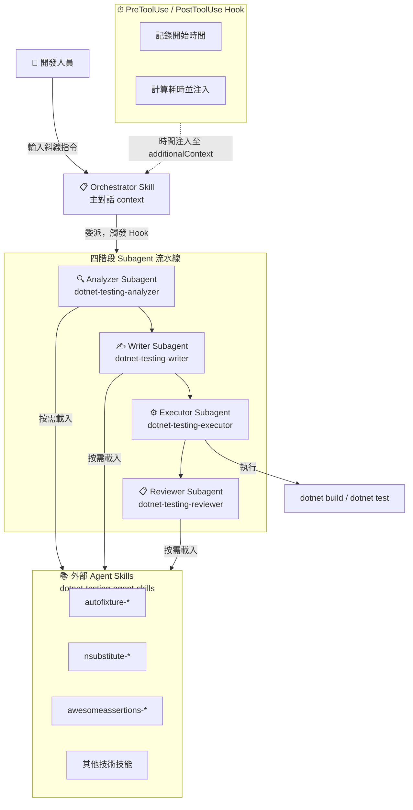
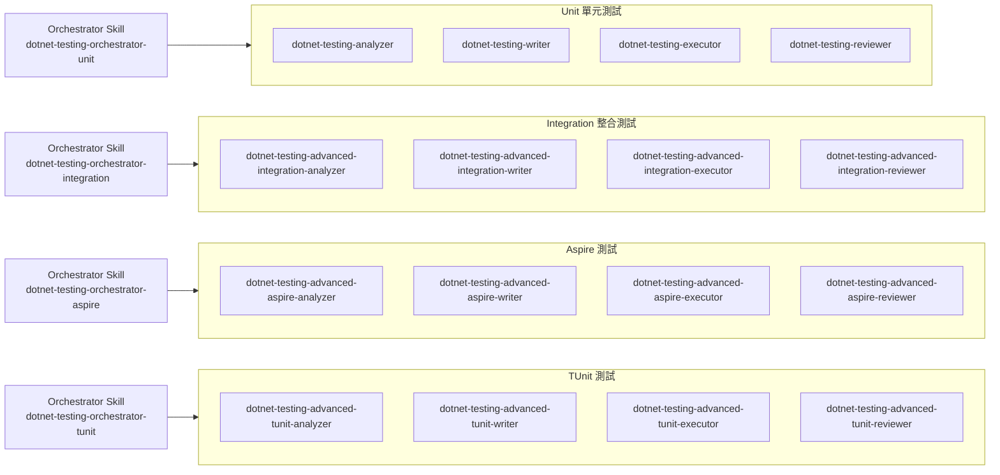
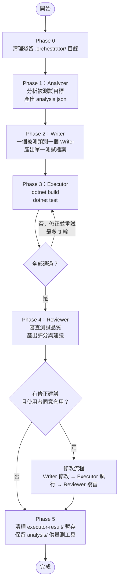
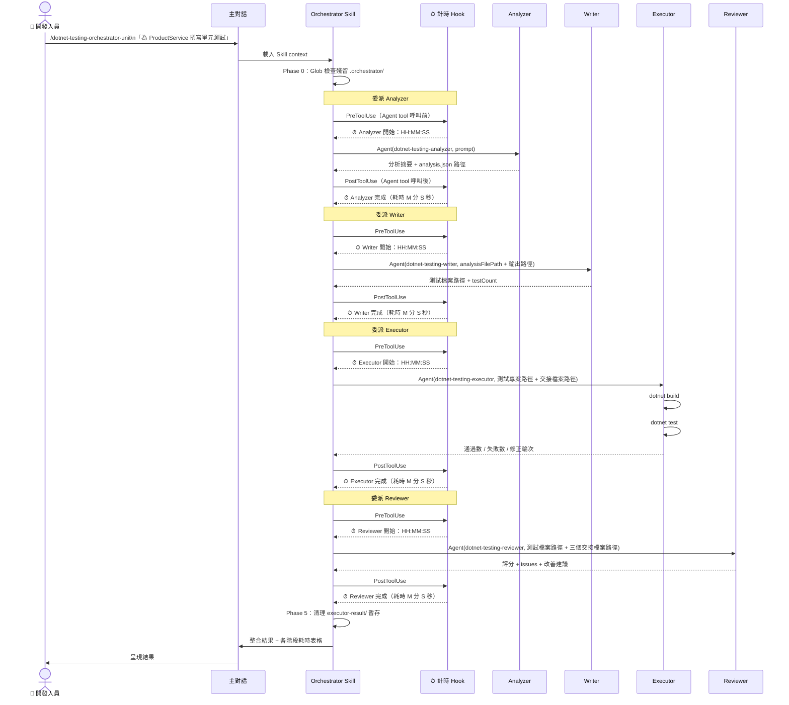

# 架構總覽

- [架構總覽](#架構總覽)
  - [1. 設計理念](#1-設計理念)
    - [Agent Orchestration](#agent-orchestration)
    - [為何 Orchestrator 使用 Skill 而非 Agent](#為何-orchestrator-使用-skill-而非-agent)
    - [bypassPermissions 設計](#bypasspermissions-設計)
    - [計時 Hook 設計](#計時-hook-設計)
  - [2. 系統架構圖](#2-系統架構圖)
  - [3. Agent 分組](#3-agent-分組)
  - [4. 標準工作流程](#4-標準工作流程)
  - [5. 執行循序圖](#5-執行循序圖)
  - [6. 關鍵設計決策](#6-關鍵設計決策)

---

## 1. 設計理念

### Agent Orchestration

Agent Orchestration 是一種多 AI 代理協作模式：由一個「指揮者」（Orchestrator）統籌協調多個「執行者」（Subagent），各司其職地完成複雜任務。

在本 repo 的架構中：

- **Orchestrator**：負責任務拆解、順序協調與結果整合，本身不撰寫任何測試程式碼
- **Subagent**：接受 Orchestrator 委派，專注執行單一職責（分析 / 撰寫 / 執行 / 審查）

這種分工讓每個 Subagent 的 context 保持精簡，避免單一 agent 因 context 過長導致品質下降。

### 為何 Orchestrator 使用 Skill 而非 Agent

Claude Code 的 Agent tool 必須在**主對話（main thread）**中才能呼叫。若 Orchestrator 本身定義為 Agent，它在子對話中執行，無法再對外委派其他 Subagent。

因此，本架構選擇將 Orchestrator 定義為 **Skill**：

- Skill 透過斜線指令（如 `/dotnet-testing-orchestrator-unit`）載入主對話的 context
- 主對話載入 Skill 後，使用自身的 Agent tool 依序委派四個 Subagent
- 每個 Subagent 的定義檔（`.claude/agents/*.md`）由 Agent tool 自動載入

### bypassPermissions 設計

每個 Subagent 的定義檔中設定 `bypassPermissions: true`。

Executor Subagent 在執行 `dotnet build` 和 `dotnet test` 時，若沒有此設定，Claude Code 會在每次 Bash 工具呼叫前彈出手動確認提示。設定 `bypassPermissions: true` 後，Subagent 在其工作範圍內可自主執行這些指令，避免中斷工作流程。

### 計時 Hook 設計

`.claude/hooks/` 下設有兩個 Bash 腳本：`dotnet-testing-agent-timer-pre.sh`（PreToolUse）和 `dotnet-testing-agent-timer-post.sh`（PostToolUse）。

這兩個 Hook 攔截所有 `subagent_type` 以 `dotnet-testing-` 開頭的 Agent tool 呼叫：

- **PreToolUse**：記錄 Subagent 開始時間，並注入 `additionalContext`（`⏱ {subagent_type} 開始：HH:MM:SS`）
- **PostToolUse**：計算耗時，注入完成時間與持續秒數（`⏱ {subagent_type} 完成：HH:MM:SS（開始：HH:MM:SS，耗時 M 分 S 秒）`）

Hook 與 Orchestrator Skill 邏輯完全解耦：Orchestrator 不需要手動呼叫 `Bash(date)`，時間資訊自動出現在 Agent tool 的回傳結果中。若 Hook 未安裝，工作流程仍可正常執行，僅缺少耗時顯示。

---

## 2. 系統架構圖

---

## 3. Agent 分組

4 組 Orchestrator 各自管轄 4 個專屬 Subagent（16 個 Agent 定義檔）。

| 組別 | Orchestrator Skill | Analyzer | Writer | Executor | Reviewer |
|------|-------------------|----------|--------|----------|----------|
| Unit | `dotnet-testing-orchestrator-unit` | `dotnet-testing-analyzer` | `dotnet-testing-writer` | `dotnet-testing-executor` | `dotnet-testing-reviewer` |
| Integration | `dotnet-testing-orchestrator-integration` | `dotnet-testing-advanced-integration-analyzer` | `dotnet-testing-advanced-integration-writer` | `dotnet-testing-advanced-integration-executor` | `dotnet-testing-advanced-integration-reviewer` |
| Aspire | `dotnet-testing-orchestrator-aspire` | `dotnet-testing-advanced-aspire-analyzer` | `dotnet-testing-advanced-aspire-writer` | `dotnet-testing-advanced-aspire-executor` | `dotnet-testing-advanced-aspire-reviewer` |
| TUnit | `dotnet-testing-orchestrator-tunit` | `dotnet-testing-advanced-tunit-analyzer` | `dotnet-testing-advanced-tunit-writer` | `dotnet-testing-advanced-tunit-executor` | `dotnet-testing-advanced-tunit-reviewer` |

---

## 4. 標準工作流程

---

## 5. 執行循序圖

---

## 6. 關鍵設計決策

| 設計選擇 | 決策 | 原因 |
|---------|------|------|
| Orchestrator 載體 | Skill（非 Agent） | Skill 在主對話中執行，才能透過 Agent tool 委派 Subagent；若定義為 Agent 則身處子對話，無法再對外委派 |
| 執行權限 | `bypassPermissions: true` | 避免每次 `dotnet build` / `dotnet test` 需要手動確認，確保工作流程自動推進 |
| 計時機制 | Hook（非 Bash date） | 與 Orchestrator 指令解耦，不佔用 Subagent 的 context；Hook 未安裝時流程仍可正常執行 |
| 大型類別處理 | 單一 Writer | 一個被測類別固定一個 Writer、一個測試檔案。早期版本會在方法數 > 5 或情境數 > 20 時拆為兩個平行 Writer，因平行 Writer 無法協調、跨檔寫法必然漂移而移除 |
| 技能載入方式 | 動態載入 Agent Skills | Analyzer 依分析結果決定 Writer 需要哪些技能（AutoFixture / NSubstitute / AwesomeAssertions 等），按需載入，避免無謂的 context 佔用 |
| 交接機制 | JSON 檔案（.orchestrator/） | Subagent 間透過 `.orchestrator/analysis/*.analysis.json` 傳遞結構化資料，而非在 prompt 中嵌入完整內容，保持每個 Subagent 的 prompt 精簡 |
| 清理策略 | 保留 analysis/，刪除 executor-result/ | analysis.json 供外部量測工具（benchmark-token.ps1）讀取；executor-result/ 為暫存資料，每次流程結束後清理 |
